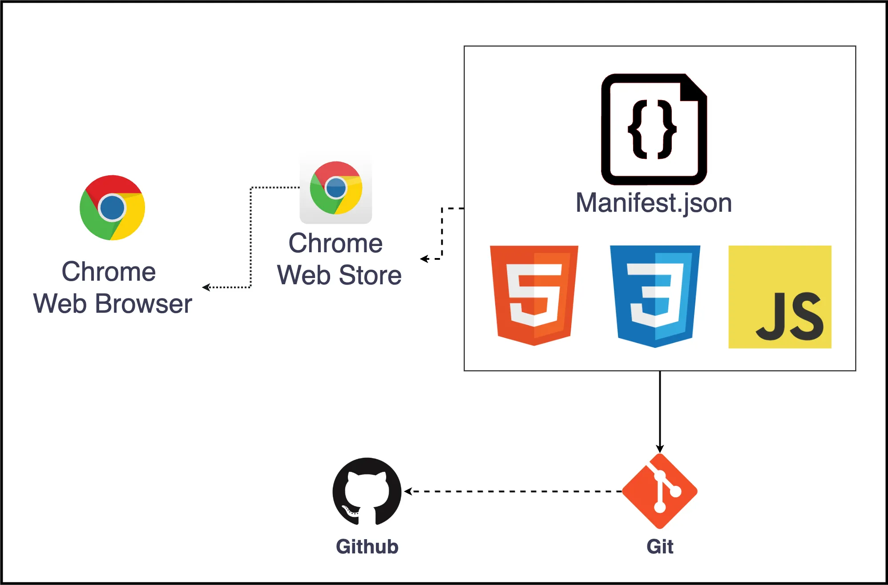

# 🔍 Youtube-Quick-Search

[🇺🇸 English](./README.md)  
どのタブでも、すばやく簡単に YouTube で動画を検索しましょう！

## 📌 概要

**Youtube-Quick-Search** は、任意のブラウザタブ上でショートカットキーを使って即座に YouTube 検索を可能にする Chrome 拡張機能です。

HTML、CSS、JavaScript を使ってシンプルに構成されており、検索のたびに YouTube サイトへアクセスする煩わしさを解消します。

---

## 🎯 プロジェクトの目的

動画で情報を探す機会が増える中、多くのユーザーは YouTube を利用しています。  
しかし、探すたびに毎回 YouTube にアクセスして検索するのは手間です。

この拡張機能は、そうした不便さを解決するために開発されました。

- より快適な動画検索体験を提供
- 自分の課題から始まり、他者と共有できるソリューションを構築
- Chrome ウェブストアでも公開予定

---

## 🛠️ 使用技術


---

## 🏗️ ハイレベルアーキテクチャ



---

## 💡 学んだこととポイント

- 明確な「不便さ」からスタートした小規模プロジェクト
- 実際のニーズを満たす、シンプルながら実用的なツール
- Chrome Extension 開発の一連のフロー（manifest, permissions, popup, content script など）を経験

---

## 🚀 インストールと実行方法

### 1. リポジトリをクローン

```bash
git clone https://github.com/minusmo/YouTube-Quick-Search-Chrome-Extension.git
cd YouTube-Quick-Search-Chrome-Extension
```

### 2. Chrome に読み込む

1. Chrome を開き、 `chrome://extensions/` にアクセス
2. 「デベロッパーモード」をオンにする
3. 「パッケージ化されていない拡張機能を読み込む」をクリック
4. このプロジェクトのディレクトリを選択

これでどのタブでもショートカットキーで YouTube 検索が可能になります 🎉

## 🔗 リンク

- 🔗 [GitHub リポジトリ](https://github.com/minusmo/YouTube-Quick-Search-Chrome-Extension)

<!--
- 🔴 Chrome Web Store リンク（公開後に追加）
-->

---

## 📜 ライセンス

MIT ライセンス  
詳しくは `LICENSE` ファイルをご確認ください。
